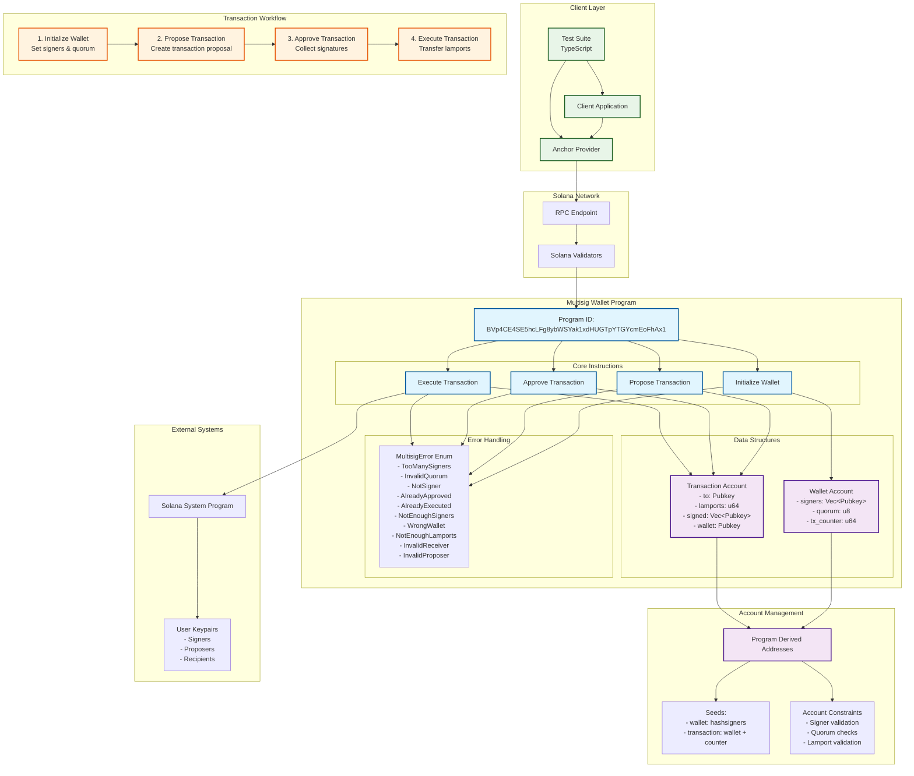

# Multisig Wallet

A secure, decentralized multisignature wallet implementation on Solana blockchain built with the Anchor framework. This project enables multiple signers to collectively manage funds through a quorum-based approval system.

## 🚀 Features

- **Multi-signature Support**: Configure multiple signers with customizable quorum thresholds
- **Transaction Proposals**: Any signer can propose transactions for approval
- **Quorum-based Execution**: Transactions execute only when sufficient signatures are collected
- **Program Derived Addresses (PDAs)**: Deterministic account generation for security
- **Comprehensive Error Handling**: Robust validation and error management
- **TypeScript Integration**: Full TypeScript support with Anchor framework
- **Test Coverage**: Comprehensive test suite for all functionality

## 🏗️ Architecture

### Core Components

1. **Wallet Account**: Stores signers, quorum threshold, and transaction counter
2. **Transaction Account**: Tracks individual transaction proposals and approvals
3. **Four Main Instructions**:
   - `initialize_wallet`: Set up the multisig wallet
   - `propose_transaction`: Create transaction proposals
   - `approve_transaction`: Collect signer approvals
   - `execute_transaction`: Execute approved transactions



### Program ID
```
BVp4CE4SE5hcLFg8ybWSYak1xdHUGTpYTGYcmEoFhAx1
```

## 📋 Prerequisites

- [Rust](https://rustup.rs/) (latest stable version)
- [Solana CLI](https://docs.solana.com/cli/install-solana-cli-tools) (v1.17.0 or later)
- [Anchor Framework](https://www.anchor-lang.com/docs/installation) (v0.31.1 or later)
- [Node.js](https://nodejs.org/) (v16 or later)
- [Yarn](https://yarnpkg.com/) package manager

## 🛠️ Installation

1. **Clone the repository**
   ```bash
   git clone <repository-url>
   cd multisig-wallet
   ```

2. **Install dependencies**
   ```bash
   yarn install
   ```

3. **Build the program**
   ```bash
   anchor build
   ```

4. **Run tests**
   ```bash
   anchor test
   ```

## 🚀 Quick Start

### 1. Initialize a Multisig Wallet

```typescript
import * as anchor from "@coral-xyz/anchor";
import { Program } from "@coral-xyz/anchor";

// Create signers
const signers = [
  web3.Keypair.generate(),
  web3.Keypair.generate(),
  web3.Keypair.generate()
];

const signersPubkeys = signers.map(s => s.publicKey);

// Initialize wallet with 2-of-3 quorum
await program.methods.initializeWallet(
  signersPubkeys,
  2  // quorum threshold
).accounts({
  wallet: walletPDA,
  payer: provider.wallet.publicKey
}).rpc();
```

### 2. Propose a Transaction

```typescript
// Any signer can propose a transaction
await program.methods.proposeTransaction(
  recipientPubkey,
  new anchor.BN(amountInLamports)
).accounts({
  wallet: walletPDA,
  proposer: signersPubkeys[0]
}).signers([signers[0]]).rpc();
```

### 3. Approve Transactions

```typescript
// Signers approve the transaction
await program.methods.approveTransaction().accounts({
  transaction: transactionPDA,
  signer: signersPubkeys[0]
}).signers([signers[0]]).rpc();

await program.methods.approveTransaction().accounts({
  transaction: transactionPDA,
  signer: signersPubkeys[1]
}).signers([signers[1]]).rpc();
```

### 4. Execute Transaction

```typescript
// Execute when quorum is reached
await program.methods.executeTransaction().accounts({
  to: recipientPubkey,
  transaction: transactionPDA,
  signer: signersPubkeys[0]
}).signers([signers[0]]).rpc();
```

## 📚 API Reference

### Instructions

#### `initialize_wallet(signers: Vec<Pubkey>, quorum: u8)`
Initializes a new multisig wallet with specified signers and quorum threshold.

**Parameters:**
- `signers`: Array of public keys authorized to sign transactions
- `quorum`: Minimum number of signatures required to execute transactions

**Constraints:**
- `quorum > 0`
- `signers.length <= 20` (MAX_SIGNERS)
- `signers.length >= quorum`

#### `propose_transaction(to: Pubkey, lamports: u64)`
Creates a new transaction proposal.

**Parameters:**
- `to`: Recipient public key
- `lamports`: Amount to transfer in lamports

**Constraints:**
- Proposer must be one of the wallet signers

#### `approve_transaction()`
Approves a pending transaction.

**Constraints:**
- Signer must be authorized wallet signer
- Signer must not have already approved
- Transaction must not be executed

#### `execute_transaction()`
Executes an approved transaction.

**Constraints:**
- Sufficient signatures collected (quorum met)
- Wallet has sufficient lamports
- Transaction not already executed

### Data Structures

#### Wallet Account
```rust
pub struct Wallet {
    pub signers: Vec<Pubkey>,    // Authorized signers
    pub quorum: u8,              // Required signatures
    pub tx_counter: u64,         // Transaction counter
}
```

#### Transaction Account
```rust
pub struct Transaction {
    pub to: Pubkey,              // Recipient
    pub lamports: u64,          // Amount
    pub signed: Vec<Pubkey>,    // Approved signers
    pub wallet: Pubkey,         // Parent wallet
}
```

### Error Types

| Error | Description |
|-------|-------------|
| `TooManySigners` | Exceeds maximum signer limit (20) |
| `InvalidQuorum` | Quorum must be greater than 0 |
| `NotSigner` | Signer not authorized for wallet |
| `AlreadyApproved` | Signer already approved transaction |
| `AlreadyExecuted` | Transaction already executed |
| `NotEnoughSigners` | Insufficient signers for quorum |
| `WrongWallet` | Transaction doesn't belong to wallet |
| `NotEnoughLamports` | Insufficient funds in wallet |
| `InvalidReceiver` | Invalid recipient address |
| `InvalidProposer` | Proposer not authorized |

## 🧪 Testing

The project includes comprehensive tests covering:

- Wallet initialization with various configurations
- Transaction proposal and approval workflows
- Error handling and edge cases
- Quorum validation
- Security constraints

Run tests with:
```bash
anchor test
```

## 🔒 Security Considerations

1. **Quorum Configuration**: Choose quorum carefully - too low compromises security, too high may cause deadlocks
2. **Signer Management**: Only add trusted signers to the wallet
3. **Transaction Review**: Always review transaction details before approval
4. **Key Management**: Secure storage of signer private keys is critical
5. **Network Security**: Use secure RPC endpoints in production

## 🚀 Deployment

### Local Development
```bash
# Start local validator
solana-test-validator

# Deploy to localnet
anchor deploy
```

### Mainnet Deployment
```bash
# Build for production
anchor build --release

# Deploy to mainnet
anchor deploy --provider.cluster mainnet-beta
```

## 📁 Project Structure

```
multisig-wallet/
├── programs/
│   └── multisig-wallet/
│       └── src/
│           ├── lib.rs                 # Main program entry point
│           ├── account.rs             # Account structures
│           ├── constants.rs           # Program constants
│           ├── errors.rs              # Error definitions
│           └── instructions/          # Instruction implementations
│               ├── initialize_wallet.rs
│               ├── propose_transaction.rs
│               ├── approve_transaction.rs
│               └── execute_transaction.rs
├── tests/
│   └── multisig-wallet.test.ts        # Test suite
├── Anchor.toml                        # Anchor configuration
├── Cargo.toml                         # Rust dependencies
└── package.json                       # Node.js dependencies
```
